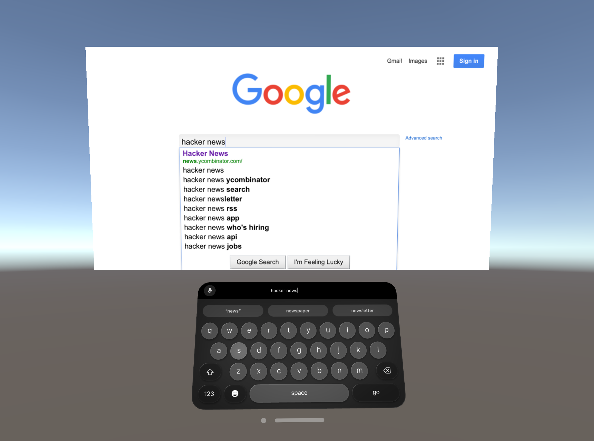

# visionOS Metal WebView Example

This Unity project demonstrates how to view and interact with web content on Apple Vision Pro using [Vuplex 3D WebView](https://developer.vuplex.com/webview/overview) with Unity's [Metal app mode](https://docs.unity3d.com/Packages/com.unity.polyspatial.visionos@2.0/manual/visionOSPlatformOverview.html#metal-rendering-with-compositor-services) for visionOS. All you need to do is import [3D WebView for visionOS](https://store.vuplex.com/webview/visionos/). The [VisionOSMetalWebViewExample.cs](Assets/Scripts/VisionOSMetalWebViewExample.cs) script demonstrates how to use 3D WebView's [scripting APIs](https://developer.vuplex.com/webview/IWebView), and you can also toggle the script's PassthroughEnabled field to toggle passthrough (enabled by default).

Notes:

- 3D WebView's native visionOS plugin can't run in the editor, so a [mock webview](https://support.vuplex.com/articles/mock-webview) implementation is used by default while running in the editor unless [3D WebView for Windows and macOS](https://store.vuplex.com/webview/windows-mac) is also installed.

- There is not currently an example of interacting with the non-Canvas [WebViewPrefab](https://developer.vuplex.com/webview/WebViewPrefab) on visionOS.



## Steps taken to create this project

1. Downloaded v2.0.4 of Unity's [visionOS template project](https://drive.google.com/drive/folders/1Oe-6bBCCmk7okbK832HWiYFbM8mV0XrZ) and opened it with Unity 6 (6000.0.25).
2. Opened the Unity Package Manager window, navigated to the page for the installed com.unity.xr.visionos package, clicked on the package's "Samples" tab, and then clicked the "Import" button for "Metal Sample - URP".
3. Made a copy of the visionOS Metal sample scene named VisionOSMetalWebViewExample:

```sh
mkdir Assets/Scenes
cp "Assets/Samples/Apple visionOS XR Plugin/2.0.4/Metal Sample - URP/Scenes/Main.unity" Assets/Scenes/VisionOSMetalWebViewExample.unity
```

4. Made the following modifications to the copied VisionOSMetalWebViewExample.unity scene:
    - Copied and pasted the Canvas object from 3D WebView's CanvasWorldSpaceDemo scene in to the scene.
    - Deleted the scene's original "Sample Canvas" canvas and repositioned the Canvas from the CanvasWorldSpaceDemo scene to take its place.
    - Made the following changes to the Canvas object:
        - Set its Event Camera to the scene's main camera
        - Added a Tracked Device Graphic Raycaster component
        - Removed the CanvasKeyboard child object
    - Deleted unneeded extra objects from the scene.
    - Removed AR-related scripts from objects (e.g. AR Plane Manager).
    - Added a "Scripting API Example" object with a VisionOSMetalWebViewExample.cs script that demonstrates how to use 3D WebView's scripting APIs and toggle the passthrough.

5. Deleted unneeded subdirectories from the Assets folder, such as the Assets/Samples directory containing the original sample scenes.
